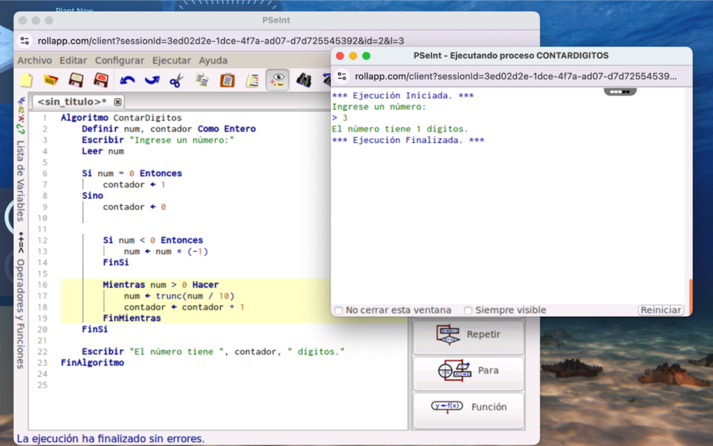

# Contar Dígitos en un Número Entero (PSeInt)

Este proyecto es un algoritmo en PSeInt que cuenta la cantidad de dígitos que tiene un número entero introducido por el usuario.

## 🚀 ¿Cómo funciona?

1. Solicita al usuario ingresar un número.
2. Si el número es cero, se cuenta como un solo dígito.
3. Si el número es negativo, lo convierte a positivo.
4. Luego, divide el número entre 10 de manera truncada y suma al contador hasta que el número sea 0.
5. Finalmente, imprime cuántos dígitos tiene.

## 🧪 Ejemplo de ejecución

## 📥 Cómo ejecutar

1. Abre PSeInt.
2. Copia y pega el código del archivo `.pse` o del bloque de código en este README.
3. Ejecuta el algoritmo presionando **F9** o el botón de ejecutar.
4. Ingresa un número entero cuando se solicite.

